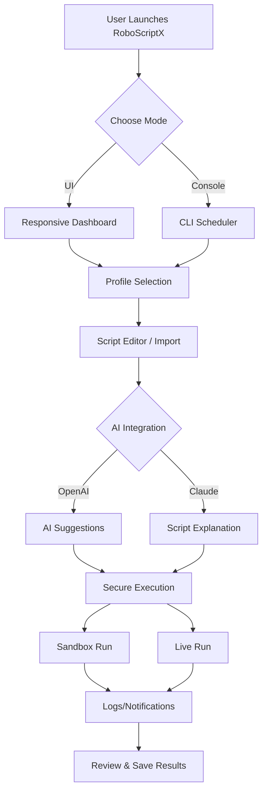

# RoboScriptX 🌟  
*A Next-Gen, Keyless, Multilingual Hub for Custom Roblox Script Workflows*

---

## 🚀 Inspiration

*In a digital world flooded with reruns, RoboScriptX reimagines the way developers and creators interface with Roblox scripts. Born from a vision of seamless automation, multilingual experience, and a truly frictionless, no-key-needed scripting journey, RoboScriptX aims to streamline your creative process while delivering a secure, innovative environment.*

---

## 📦 What is RoboScriptX?

**RoboScriptX** is a robust, advanced workstation for Roblox automation and script execution. It lets you organize, run, schedule, and tweak scripts—without any barrier keys or discord hoops to jump through—while fostering security, speed, and accessibility. With OpenAI and Claude API integration, plus a responsive UI and 24/7 support, RoboScriptX is built for visionaries, speedrunners, and anyone who cares about elegant gameplay automation.

---

## 🦄 Key Features

- **Keyless Script Execution:** Say goodbye to constant key-hunting or locked-down downloads—RoboScriptX puts control in your hands.
- **Responsive, Touch-Friendly UI:** Optimized for desktops, tablets, and mobile phones with buttery-smooth transitions.
- **OpenAI & Claude API Integration:** Use Generative AI to suggest, explain, or even auto-complete your Roblox scripts.
- **Profile-Based Workflows:** Save profiles for different games, use cases, or alt accounts. Switch instantly.
- **Multilingual Support:** Full interface and documentation support for 20+ languages, from English to Korean to Spanish.
- **24/7 Customer Support:** Real humans and AI virtual agents, whenever you need assistance.
- **Secure Script Sandbox:** Run or test scripts in a safe, isolated environment.
- **Smart Scheduler:** Set scripts to run at precise times or in response to in-game events—automate your edge.
- **Advanced Console:** Detailed log output, realtime error tracking, and colored console notifications.
- **Extensible Plugin System:** Easily add more features or integration points.

---

## 🧩 SEO-Friendly Keywords (naturally woven)

RoboScriptX redefines Roblox script execution, automated Roblox workflows, and secure, versatile script management. Empower your digital Roblox experience with zero-hassle keyless solutions, AI-powered code assistance, and top-tier multilingual gameplay utilities.

---

## 🖥️ OS Compatibility (2026 Preview)

| OS           | Supported | UI Optimized | Native Binaries |  
|--------------|:---------:|:------------:|:---------------:|
| 🪟 Windows   | ✅        | ✅           | ✅              |
| 🍏 macOS     | ✅        | ✅           | ✅              |
| 🐧 Linux     | ✅        | ✅           | ✅              |
| 📱 Android   | ✅        | ✅           | 🚧 (partial)    |
| 📱 iOS       | ✅        | ✅           | 🚧 (partial)    |

---

## 📈 Feature Checklist

- 🔐 **Secure Roblox Script Automation**
- 💡 **AI Assistance via OpenAI & Claude**
- 🌎 **20+ Languages**
- 🧑‍🤝‍🧑 **Profile & Team Collaboration**
- ⏰ **Smart Scheduling and Triggers**
- 🔌 **Plugin/Extension Architecture**
- 🚨 **Error Reporting and Crash Recovery**
- ⚙️ **Customizable User Settings**
- 🧭 **Intuitive Navigation Panels**
- 💬 **Discord, Slack, and Email Integrations**
- 🖊️ **Script Editor with Syntax Highlighting**
- 📋 **One-Click Clipboard Copy & Paste**
- 🌔 **Dark/Light/Auto Theme Modes**
- 🛡️ **Frequent Security Updates**

---

## 🎨 Example Profile Configuration

Below is a sample **profile.yaml** for organizing your automation across different games and accounts:

    profile:
      name: "SpeedRun_Farming"
      description: "Automates gem collection on Game123"
      language: "en"
      schedule: 
        - type: "event"
          trigger: "join_game"
          action: "execute_script"
      scripts:
        - path: "scripts/farm_gems.lua"
          enabled: true
      ai_assist: true
      notifications: 
        email: "myemail@domain.com"
        discord: "true"
        slack: "false"

---

## 🖥️ Example Console Invocation

    roboscriptx run --profile SpeedRun_Farming --ai --language en

You can *mix and match* flags:
- `--ai`: Turn on AI suggestions.
- `--sandbox`: Run in a virtual, safe Roblox environment.
- `--ui`: Launch with GUI.

---

## 🤖 AI Integration: OpenAI & Claude

Connect your [OpenAI](https://platform.openai.com/) and [Claude](https://claude.ai/) API keys in the app settings.
- **AI Suggestions:** Get function explanations or code snippets as you write.
- **Code Completion:** Type less, generate more.
- **Explain Errors:** Let AI break down runtime or compilation errors—saving hours on debugging.

---

## 💬 Multilingual Support

Change your interface language anytime! RoboScriptX supports:
- 🇺🇸 English
- 🇪🇸 Español
- 🇯🇵 日本語
- 🇰🇷 한국어
- 🇨🇳 简体中文 & 繁體中文
- 🇫🇷 Français
- 🇩🇪 Deutsch
- …and more!

Help us add more languages—translations are community-powered and fully open!

---

## 📈 Mermaid Diagram: Workflow Overview

---

## 🍀 Benefits You’ll Actually Feel

- **Time Savings:** Focus on creativity, not on ‘finding keys’ or jumping hoops.
- **Security:** Each script operates in a safe pod—protecting your data and reputation.
- **Team Empowerment:** Create, share, and adapt workflow profiles for your entire development crew.
- **Global Readiness:** From Tokyo to São Paulo, RoboScriptX speaks your language and supports your platform.

---

## 📣 Disclaimer

*RoboScriptX is an independent, educational software utility. It’s designed strictly for personal development and automation workflows. We do not condone or support the use of this software for any activity that violates Roblox’s Terms of Service or other applicable policies. Use at your own discretion and always respect the boundaries of online communities.*

---

## 📝 License

This project is licensed under the MIT License.  
See [LICENSE](./LICENSE) for details.

---

## 📥 Download RoboScriptX (2026 Edition)

---

Let your automation adventure begin—powered by RoboScriptX!